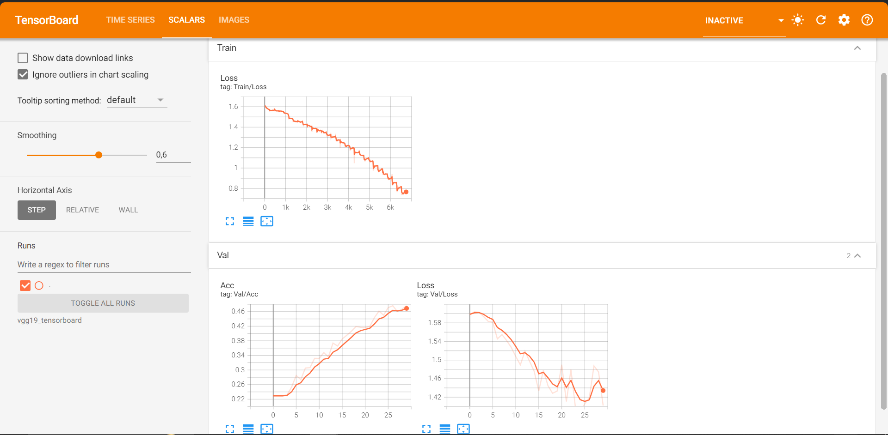
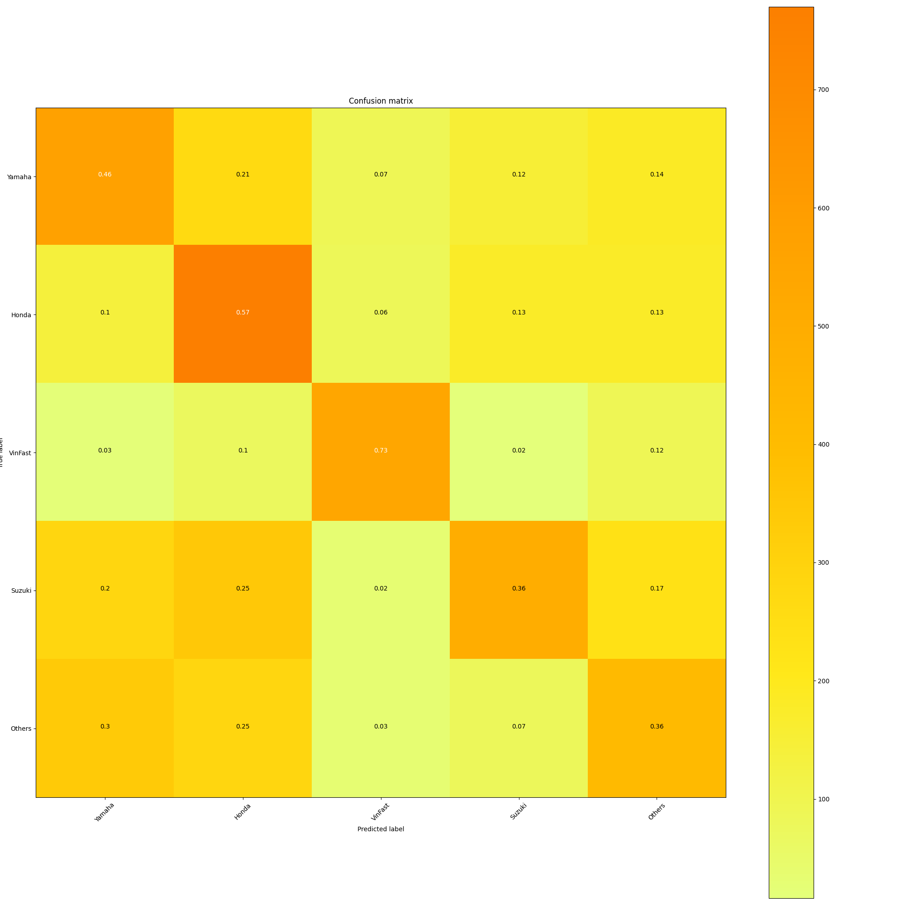
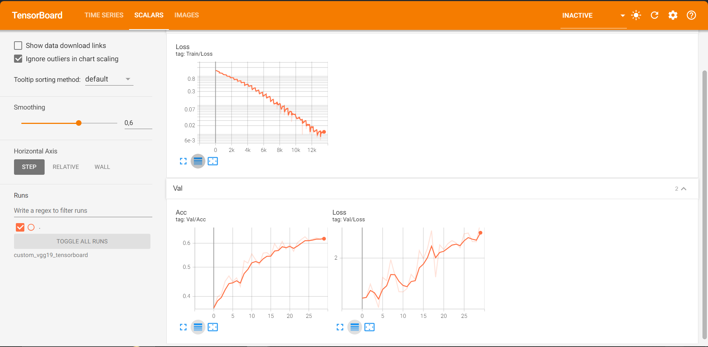
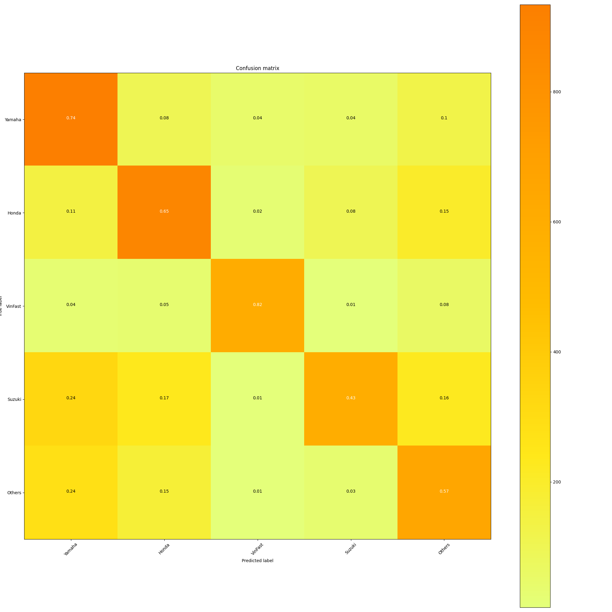
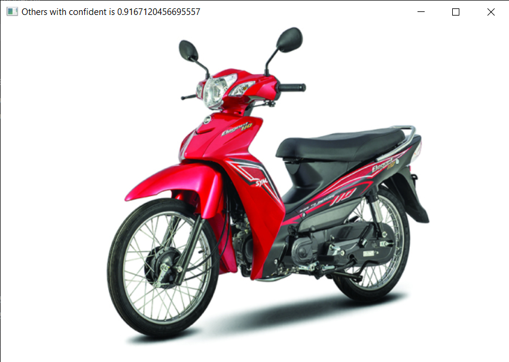
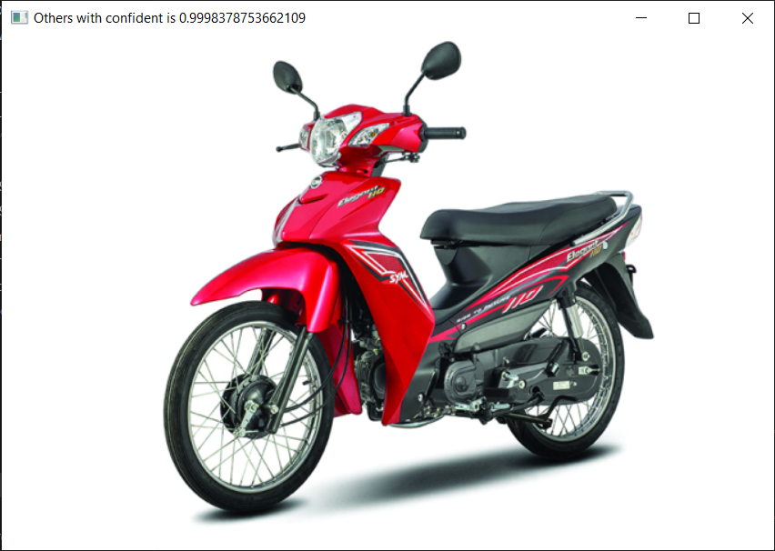
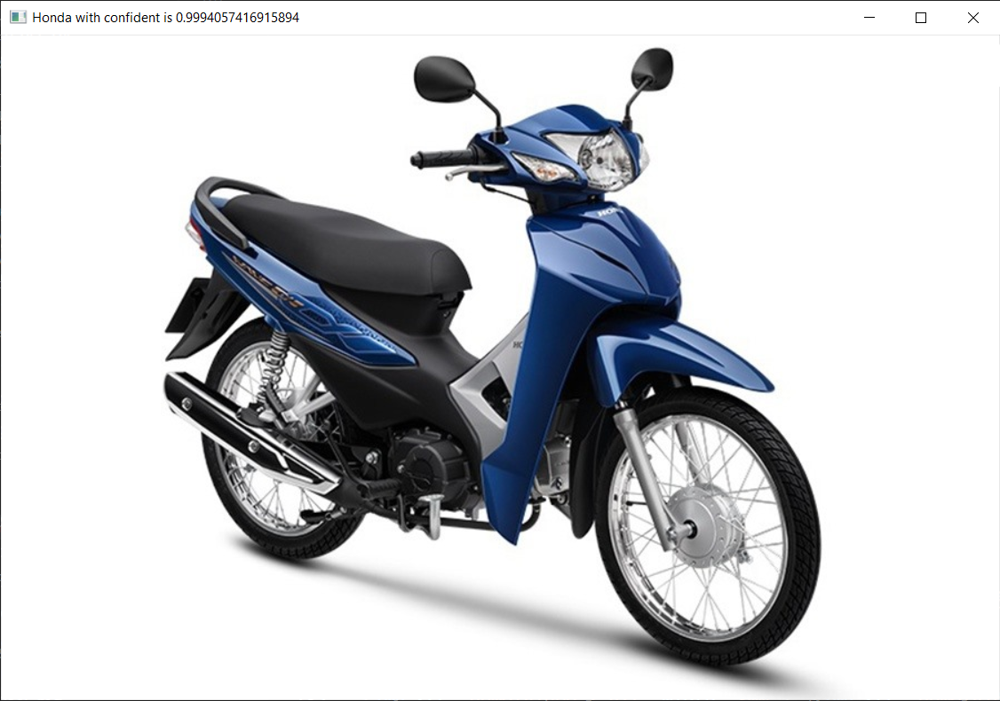
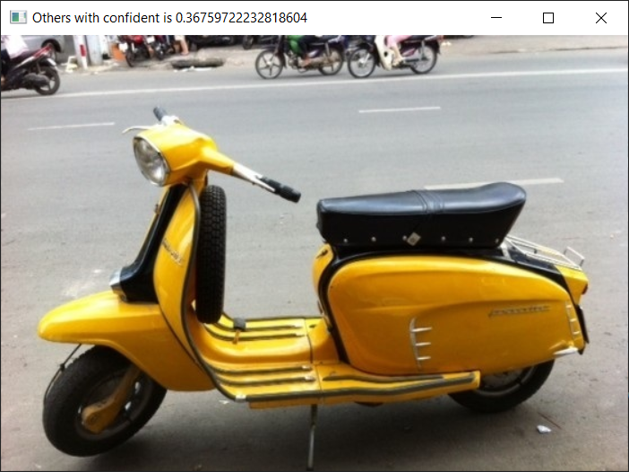
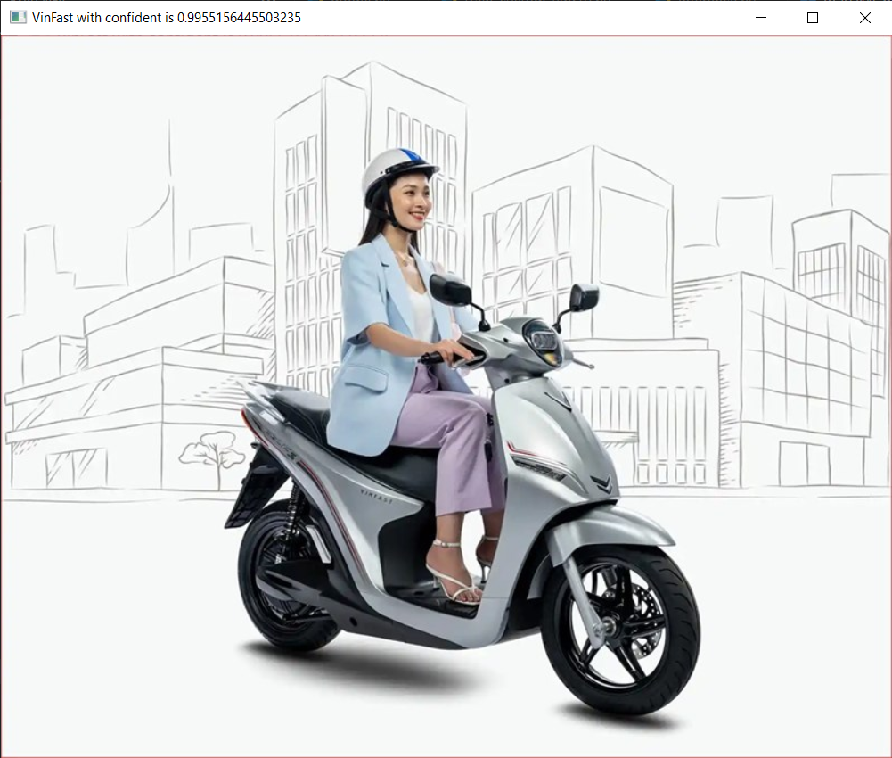

# [PYTORCH] Original VGG19 vs Custom VGG19 Image Classification

## Introduction

Here is my PyTorch implementation with two models: the **default VGG19** model and a **custom VGG19** model, applied to a motorbike brand classification task consisting of 5 classes.


### Modified model (batch norm. added in each cnn layer)
```python
        # 1-1 conv layer
        tnn.Conv2d(3, 64, kernel_size=3, padding=1),
        tnn.BatchNorm2d(64),
        tnn.ReLU(),

        # 1-2 conv layer
        tnn.Conv2d(64, 64, kernel_size=3, padding=1),
        tnn.BatchNorm2d(64),
        tnn.ReLU(),
```
 
## How to use my code

With my code, you can:
* **Train your model from scratch**
* **Train your model with my trained model**
* **Evaluate test images/videos with either my trained model or yours**

## Requirements:

* **python 3.11**
* **pytorch 2.4**
* **opencv (cv2)**
* **tensorboard**
* **tensorboardX** (This library could be skipped if you do not use SummaryWriter)
* **torchvision**
* **PIL**
* **numpy**
* **tqdm**
* **sklearn**

## Datasets:

This is a private dataset crawled from the internet by members of my class. Since it has not been manually verified, we acknowledge that this dataset may contain some issues such as duplicate images, corrupted images, or misclassifications. However, it is only used for the purpose of demonstrating the two models.

| Dataset                        | #Classes | #Train images | #Validation images |
|--------------------------------|:--------:|:-------------:|:------------------:|
| Motorbike-Brand                |    5     |      28887    |        5861        |

Create a data folder under the repository,

```
cd {repo_root}
mkdir data
```

Make sure to put the files as the following structure:
  ```
  Motorbike-Brand
  ├── train
  │   ├── Honda  
  │   ├── Others
  │   ├── Suzuki
  │   ├── VinFast
  │   ├── Yamaha
  ├── test
  │   ├── Honda  
  │   ├── Others
  │   ├── Suzuki
  │   ├── VinFast
  │   ├── Yamaha
  ```
## Setting:

* **Model structure**: 
  * **VGG19**: I used the default VGG19 model, initialized with random weights.
  * **Custom_VGG19**: I modified the VGG19 model by adding a BatchNorm2d layer between the Conv and ReLU layers in the conv block.
* **Data augmentation**: I only resized images to the standard size of 224x224 pixels for input.
* **Loss**: I used the CrossEntropyLoss as my loss function
* **Optimizer**: I used the SGD optimizer with a learning rate of 0.001 and momentum of 0.9.
* All other hyperparameters are set the same for both models.

## Trained models

You could find trained models I have trained in [link](https://drive.google.com/drive/folders/1uX3v68jpwtTRbGNygDMjCy0OhgPbVrV2?usp=sharing)

## Training

I provide my pre-trained model named **best.pt** in each model folder. You can place it in the folder **(model name)_checkpoint/** and load it before training your new model for faster convergence. For example: "vgg19_checkpoint/".

If you want to train a new model, you could run:
- **python train_vgg19.py --data_path path/to/input/folder**: For example, python train_vgg19.py --data_path "Motorbike-Brand"
- or 
- **python train_custom_vgg19.py --data_path path/to/input/folder**: For example, python train_custom_vgg19.py --data_path "Motorbike-Brand"

## Test

By default, my test script will load trained model from folder **custom_vgg19_checkpoint/**. You of course could change it to other folder which contains your trained model(s).

If you want to test a trained model with image, you could run:
- **python inference.py -i path/to/input/image**: For example, python inference.py -i images/motorbike.jpg

## Experiments:

I trained models with GPU P100 on Kaggle for 30 epochs

The training/test loss curves for each experiment are shown below:

- **VGG19**
  - **Loss**

  - **Confusion Matrix**


- **Custom VGG19**
  - **Loss**

  - **Confusion Matrix**


## Results

Some output predictions for experiments are shown below:

- **VGG19**

      

- **Custom VGG19**

    

## My Review

- In the default VGG19 model, the model learns quite steadily with loss gradually decreasing and accuracy increasing over time. However, the learning process is slow, ending with an accuracy of around ~50%.

- In the custom VGG19 model, an issue occurred where both loss and accuracy increased (but in the end it still reach ~60% accuracy, better than the default VGG19 model). From my research, this issue could be due to the following reasons:
  - Some images with borderline predictions are predicted better, and their output class changes to the correct one, leading to an increase in accuracy.
  - Some images with very poor predictions keep getting worse, leading to an increase in loss.
  - **=> It can be concluded that while the model predicts better for images with borderline predictions, the incorrect predictions become increasingly worse. (Overfitting)**
- I suspect this issue may be related to the dataset. Since this is just a dataset that was collected without being manually checked, the quality might not be high. I will update my findings after more research.
